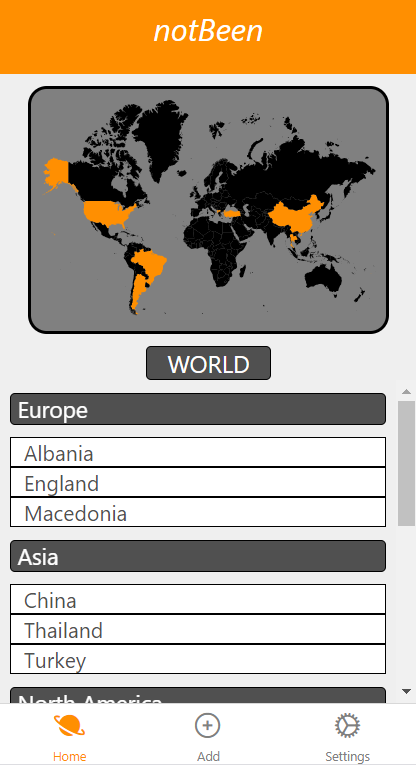
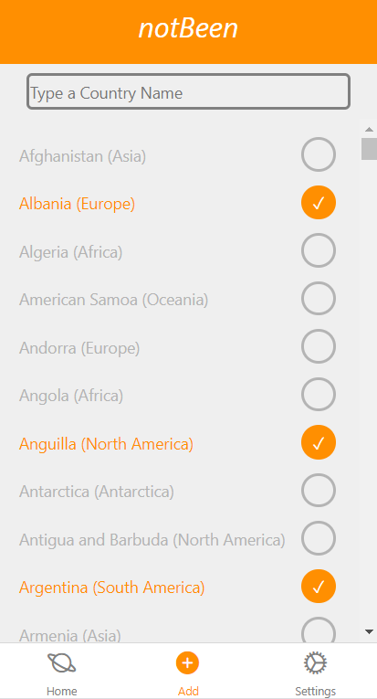
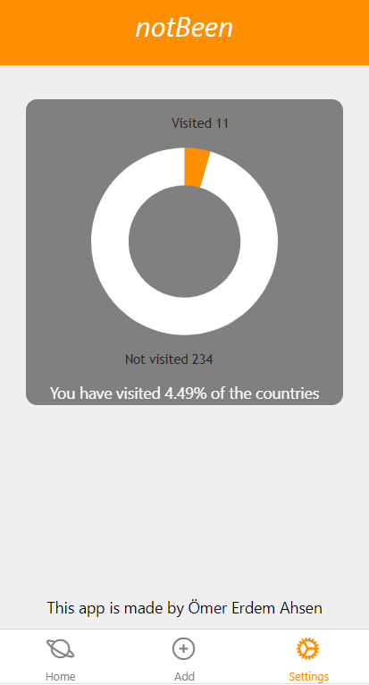

## NotBeen App
# What is this app ?
  This is an app made by Ömer Erdem Ahsen. This project aims to clone and improve already existing app called "Been" which was released on IOS and Android.
  At NotBeen you can add the countries you have visited and save it. It will group the countries according to their continents and show it in a eye-catching way. Pretty   simple huh :)

# ScreenShots From the App

  
  
  

# How can I run the app ?
  You can download the project and use it with [expo-cli](https://docs.expo.io/get-started/installation).
  If you want to run it online then here is the Snack Expo link that provides an online emulator.  
  Snack Expo: https://snack.expo.dev/@erdemahsen/notbeen

#Ömer Erdem Ahsen

